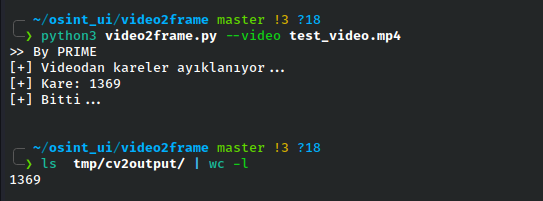

# video2frame

A simple python3 script that breaks down videos frame by frame for better review. I wanted to share it because I couldn't find an easy and fast solution on the internet..

<hr>
<h2>Usage: </h2>
Requirements:
python3.X ve OpenCv

```sh
# Usage:
python3 video2frame.py --video /home/user/video.mp4 
```

```sh
# Every startup issue clears the tmp/cv2output but can be cleared by hand.
python3 video2frame.py --clsoutdir 
```

It assigns the processing results to tmp/cv2output in the folder where it is run.
It only saves the frames with odd sequence numbers to avoid too many frames..

<h2>Example:</h2>
</br>
 

